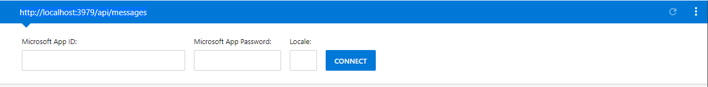
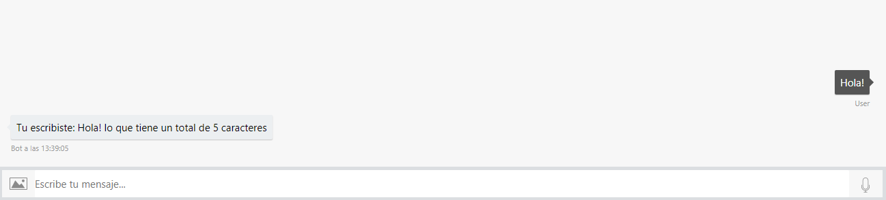
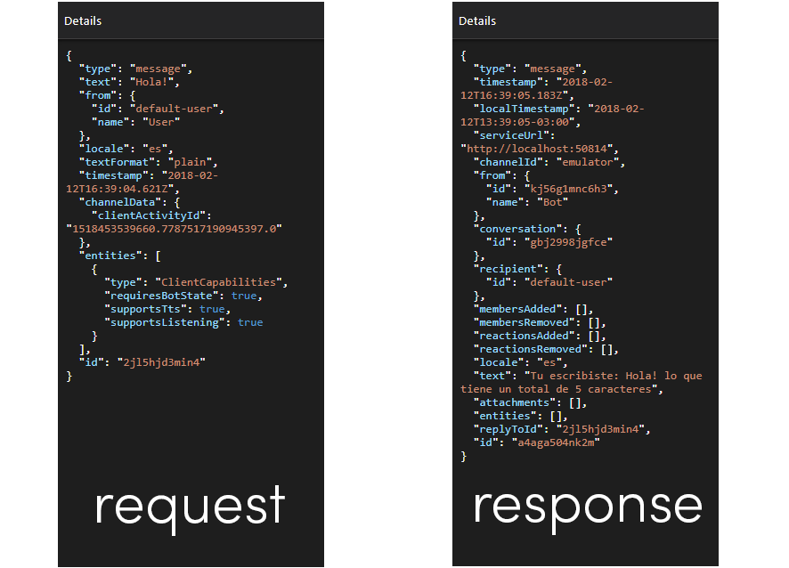

# Bot Length

Este bot fué creado con el propósito de probar el ambiente de desarrollo, se utilizó el Microsoft Bot Framework para C# y el  Bot Builder SDK para .NET . 

## Set up del ambiente de desarrollo
Para hacer funcionar el bot debes seguir la siguiente guía:
[Guía para montar y probar el bot](Guide.pdf)

## Capturas

Al compilar el código, el bot se ejecutará en la siguiente dirección

**El puerto puede variar**

La API funciona bajo el método HTTP POST,siguiente error al hacer una petición GET

Para probar el bot se puede utilizar el BOT Framework Emulator, en mi caso la conexión es la siguiente:

Probando el bot con el mensaje 'Hola!', el BOT responde correctamente

El mensaje que recibe y retorna el BOT está estructurado en JSON y es el BOT Framework Emulator el que se encarga de hacer la conversión.

