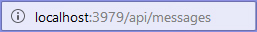

# Bot Length

Este bot fué creado con el propósito de probar el ambiente de desarrollo, se utilizó el Microsoft Bot Framework para C# y el  Bot Builder SDK para .NET . 

## Set up del ambiente de desarrollo
Para hacer funcionar el bot debes seguir la siguiente guía:
[Guía para montar y probar el bot](Guide.pdf)

## Capturas

Al compilar el código, el bot se ejecutará en la siguiente dirección

    **El puerto puede variar**

La API funciona bajo el método HTTP POST, por lo que encontraremos el siguiente error

Para probar el bot se puede utilizar el BOT Framework Emulator

En mi caso la conexión es la siguiente

Probando el bot con el mensaje 'Hola!', el BOT responde correctamente

El mensaje que retorna el BOT es JSON que el BOT Framework emulator se encarga de procesar.

